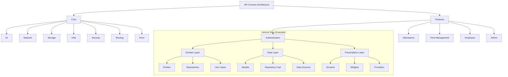
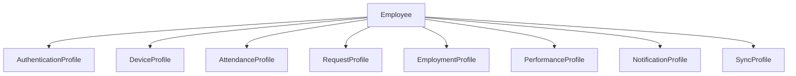
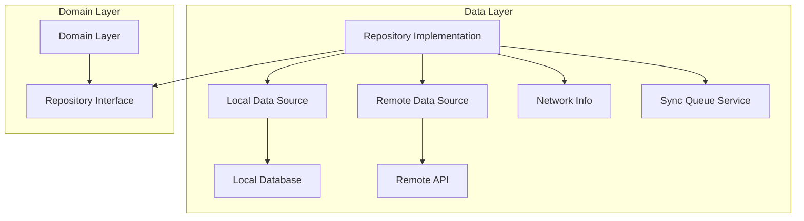
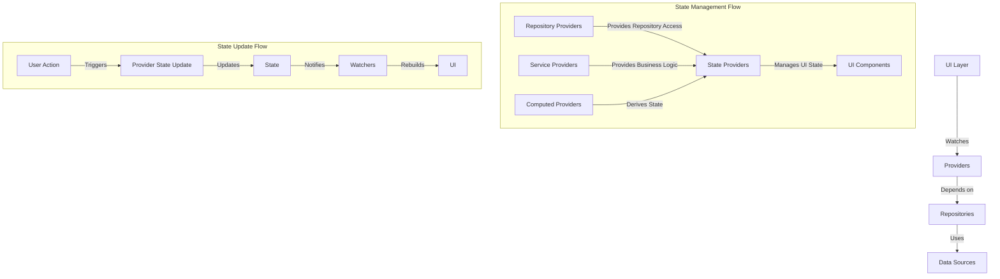

# Architecture Overview Diagrams

This file contains diagrams illustrating the high-level architecture of HR Connect.

## Modified Vertical Slice Architecture (MVSA)



## Aggregate Pattern



## Repository Pattern



## Offline-First Data Flow

```mermaid
sequenceDiagram
    participant UI as UI Layer
    participant UC as Use Case
    participant REPO as Repository
    participant LDS as Local Data Source
    participant RDS as Remote Data Source
    participant SYNC as Sync Queue
    
    UI->>UC: Request Data
    UC->>REPO: Get Data
    REPO->>LDS: Get Local Data
    
    alt Local Data Exists
        LDS-->>REPO: Return Local Data
        REPO->>UC: Return Data
        UC->>UI: Display Data
        
        REPO->>+SYNC: Check Network Status
        
        alt Is Online
            SYNC-->>-REPO: Online
            REPO->>RDS: Get Fresh Data
            RDS-->>REPO: Return Remote Data
            REPO->>LDS: Update Local Cache
            REPO->>UC: Return Fresh Data
            UC->>UI: Update UI
        end
    else No Local Data
        LDS-->>REPO: Cache Miss
        
        REPO->>+SYNC: Check Network Status
        
        alt Is Online
            SYNC-->>-REPO: Online
            REPO->>RDS: Get Remote Data
            RDS-->>REPO: Return Remote Data
            REPO->>LDS: Cache Data
            REPO->>UC: Return Data
            UC->>UI: Display Data
        else Is Offline
            SYNC-->>-REPO: Offline
            REPO->>UC: Return Error
            UC->>UI: Show Error
        end
    end
```

## State Management



## Dependency Injection

```mermaid
graph TD
    A[GetIt Service Locator] --> B[Core Module]
    A --> C[Feature Modules]
    
    B --> B1[Network Module]
    B --> B2[Storage Module]
    B --> B3[Auth Module]
    
    C --> C1[Auth Feature Module]
    C --> C2[Attendance Feature Module]
    C --> C3[Time Management Feature Module]
    
    subgraph "Registration Types"
        D1[Singleton]
        D2[LazySingleton]
        D3[Factory]
        D4[EnvironmentFactory]
    end
    
    subgraph "Initialization Flow"
        E1[main.dart] --> |Initializes| E2[Service Locator]
        E2 --> |Registers| E3[Core Dependencies]
        E2 --> |Registers| E4[Feature Dependencies]
        E3 --> |Available via| E5[GetIt.get()]
        E4 --> |Available via| E5
    end
``` 