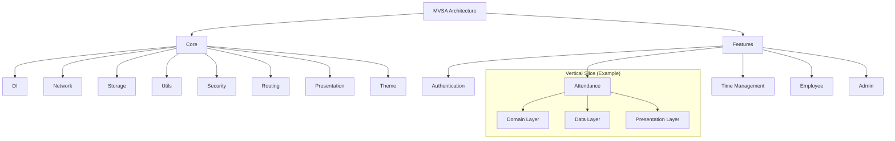
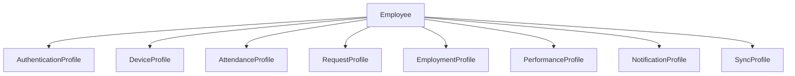

# Modified Vertical Slice Architecture (MVSA)

## Overview

HR Connect follows the Modified Vertical Slice Architecture (MVSA) pattern, which organizes code around business capabilities rather than technical concerns. This approach provides clear boundaries between features and promotes independent development and testing of each business capability.

MVSA addresses common challenges with traditional layered architectures:
- Avoids cross-cutting changes across multiple layers
- Reduces coupling between features
- Enables parallel development of features by different teams
- Simplifies reasoning about business functionality
- Facilitates incremental adoption of new technologies and patterns

## Core + Features Approach

The application is divided into two main parts:

1. **Core**: Shared infrastructure and utilities used across the application
2. **Features**: Business capabilities implemented as independent vertical slices

### Core Components

The Core module contains shared infrastructure that supports all features:

- **Dependency Injection** - Service location and registration
- **Error Handling** - Base failure classes and error utilities
- **Network** - API communication and interceptors
- **Storage** - Local database and secure storage
- **Utils** - Common utilities and extension methods
- **Security** - Authentication, encryption, and security services
- **Routing** - Navigation infrastructure
- **Presentation** - Shared UI components and widgets
- **Theme** - Application styling and theming

### Feature Slices

Each feature in HR Connect represents a complete vertical slice that:

- Cuts across all architectural layers (domain, data, presentation)
- Encapsulates a specific business capability
- Contains all necessary components for the feature
- Can be developed and tested independently

The main feature slices in HR Connect are:

- **Authentication** - User login, registration, and device management
- **Attendance** - QR code generation, scanning, and validation
- **Time Management** - Leave requests, approvals, and time tracking
- **Employee** - Profile management and document handling
- **Admin** - Administrative portals for HR and payroll

## Anatomy of a Vertical Slice

```
features/
  attendance/                # Example feature slice
    domain/                  # Domain layer
      entities/              # Business entities
        qr_code.dart
        attendance_record.dart
      repositories/          # Repository interfaces
        qr_code_repository.dart
        attendance_repository.dart
      use_cases/             # Business use cases
        validate_qr_code.dart
        submit_attendance.dart
    data/                    # Data layer
      models/                # Data models
        qr_code_model.dart
        attendance_record_model.dart
      repositories/          # Repository implementations
        qr_code_repository_impl.dart
        attendance_repository_impl.dart
      datasources/           # Data sources
        local/
          qr_code_local_datasource.dart
        remote/
          qr_code_remote_datasource.dart
    presentation/            # UI layer
      screens/               # UI screens
        qr_scanner_screen.dart
        attendance_history_screen.dart
      widgets/               # UI components
        qr_code_display.dart
        attendance_record_item.dart
      providers/             # State management
        qr_code_provider.dart
        attendance_provider.dart
```

## Clean Architecture Within Slices

Within each slice, HR Connect follows Clean Architecture principles with three main layers:

### Domain Layer

The domain layer contains the core business logic and rules:

- **Entities**: Business objects with validation rules
- **Value Objects**: Immutable objects representing concepts with inherent validation
- **Repository Interfaces**: Abstract definitions of data access
- **Use Cases**: Application-specific business rules

This layer has no dependencies on any other layer or external frameworks.

### Data Layer

The data layer implements the repository interfaces from the domain layer:

- **Models**: Data transfer objects (DTOs) for JSON serialization
- **Repositories**: Concrete implementations of domain repositories
- **Data Sources**: Local and remote data access implementations

This layer depends on the domain layer and external data access frameworks.

### Presentation Layer

The presentation layer handles UI concerns and state management:

- **Screens**: Complete UI screens composed of widgets
- **Widgets**: Reusable UI components
- **Providers**: State management using Riverpod
- **View Models**: UI-specific state and logic

This layer depends on the domain layer for business logic but not on the data layer.

## Aggregate Pattern

HR Connect employs the Aggregate pattern for domain modeling:

- **Employee** is the primary aggregate root
- Supporting profile aggregates maintain references to their parent Employee:
  - **AuthenticationProfile** - Authentication credentials and status
  - **DeviceProfile** - Registered devices
  - **AttendanceProfile** - Attendance records
  - **RequestProfile** - Leave requests and approvals
  - **EmploymentProfile** - Job details and organizational placement
  - **PerformanceProfile** - Goals, KPIs, and reviews
  - **NotificationProfile** - User notifications
  - **SyncProfile** - Synchronization status

Each aggregate enforces its own business rules and invariants.

## Communication Between Slices

Features communicate with each other through:

1. **Domain Events**: For asynchronous, loosely coupled communication
2. **Shared Domain Models**: For data exchange
3. **Core Services**: For common functionality

Direct dependencies between features are avoided to maintain separation of concerns.

## Mermaid Diagrams

### High-level MVSA Overview



### Aggregate Relationship Diagram



## MVSA Benefits in HR Connect

The MVSA approach provides several benefits for HR Connect:

1. **Business-Focused Organization**: Code is organized around business capabilities, making it easier to understand and maintain
2. **Independent Development**: Features can be developed and tested independently, facilitating parallel work
3. **Isolated Changes**: Most changes are confined to a single vertical slice, reducing the risk of unintended side effects
4. **Simplified Testing**: Features can be tested in isolation, making tests more focused and reliable
5. **Offline-First Support**: Each feature can implement its own offline capabilities within its vertical slice
6. **Scalability**: New features can be added without modifying existing ones 