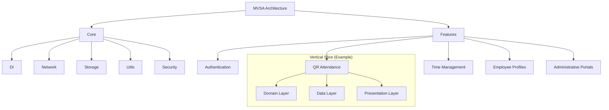
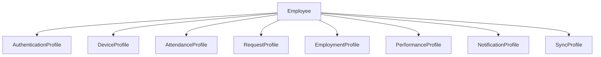
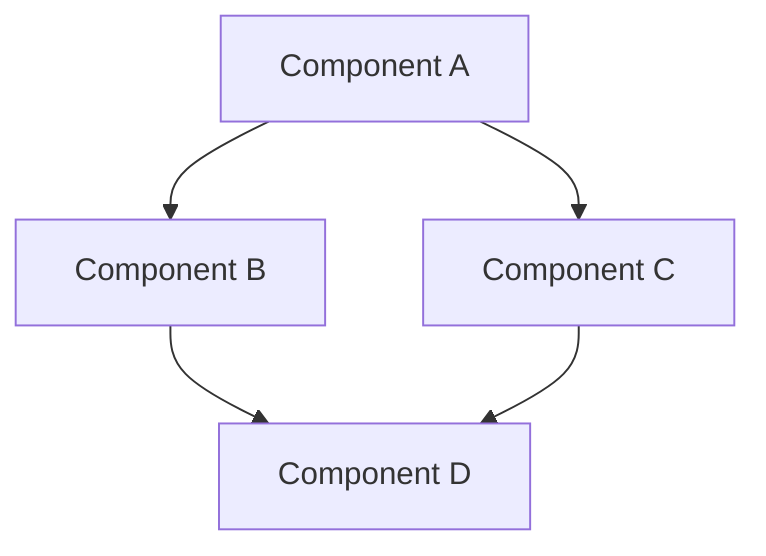

# Implementation Guide: Develop Comprehensive Architecture Documentation

## Task Information
- **Task ID**: 01-005-03
- **Title**: Develop comprehensive architecture documentation in markdown format (MVSA pattern, folder structure, DI, state management, coding standards)
- **Status**: Pending
- **Dependencies**: Tasks 01-001-01 through 01-005-02
- **Priority**: High

## 1. Introduction

### 1.1 Purpose
This guide provides step-by-step instructions for creating comprehensive architecture documentation for the HR Connect application. Architecture documentation is crucial for:

- Providing a clear overview of the system design
- Enabling new developers to understand the application quickly
- Ensuring consistency in development approaches
- Serving as a reference for architectural decisions
- Supporting future maintenance and extensions

### 1.2 Task Overview
The task involves creating detailed markdown documentation that describes:
- The Modified Vertical Slice Architecture (MVSA) pattern used in the application
- Project folder structure and organization
- Dependency Injection (DI) implementation
- State management approach with Riverpod
- Coding standards and conventions

### 1.3 Target Audience
The documentation will be used by:
- Current development team members
- Future developers who join the project
- Technical leads and architects
- Quality assurance personnel

## 2. Prerequisites

### 2.1 Required Knowledge
- Understanding of the HR Connect application structure
- Familiarity with Dart and Flutter development
- Knowledge of the MVSA pattern
- Understanding of get_it and injectable for DI
- Experience with Riverpod for state management

### 2.2 Required Tools
- Markdown editor (VS Code with Markdown extensions recommended)
- Access to the project repository
- Diagram creation tools (Mermaid, PlantUML, or similar)
- Git for version control

### 2.3 Reference Materials
- HR Connect Flutter Development Guidelines
- HR Connect PRD (Product Requirements Document)
- Existing codebase and structure
- Flutter package documentation

## 3. Documentation Structure and Organization

### 3.1 Recommended File Organization

Create the following markdown files in the `/docs/architecture` directory:

```
/docs
  /architecture
    README.md                    # Overview and table of contents
    mvsa-overview.md             # MVSA pattern explanation
    folder-structure.md          # Project organization
    dependency-injection.md      # DI implementation
    state-management.md          # Riverpod state management
    coding-standards.md          # Development conventions
    /diagrams                    # Folder for diagram source files and images
    /examples                    # Code and implementation examples
```

### 3.2 Document Hierarchy

1. **README.md**: Serves as the entry point with an overview of the architecture and links to detailed documents
2. **Detailed Documents**: Separate files for each major architectural aspect
3. **Supporting Materials**: Diagrams and examples to illustrate concepts

### 3.3 Cross-Referencing Approach

Use relative links between documents for easy navigation:
```markdown
For more details on dependency injection, see [Dependency Injection](./dependency-injection.md).
```

## 4. Content Development Guide

### 4.1 MVSA Pattern Documentation

#### 4.1.1 Key Concepts to Document

- Core + Features approach in MVSA
- Vertical slices aligned with business capabilities
- Separation of concerns within slices (domain, data, presentation)
- Aggregate pattern with Employee as primary root
- Integration between features and core components

#### 4.1.2 Recommended Diagrams

1. **High-level MVSA Overview**:



2. **Aggregate Relationship Diagram**:



#### 4.1.3 Example Section Template

```markdown
## Modified Vertical Slice Architecture (MVSA)

### Overview
The HR Connect application follows the Modified Vertical Slice Architecture (MVSA), 
which organizes code around business capabilities rather than technical concerns. 
This approach provides clear boundaries and promotes independent development of features.

### Core + Features Approach
The application is divided into two main parts:
1. **Core**: Shared infrastructure and utilities used across the application
2. **Features**: Business capabilities implemented as independent slices

### Vertical Slices
Each feature in the application represents a complete vertical slice that:
- Cuts across all architectural layers (domain, data, presentation)
- Encapsulates a specific business capability
- Can be developed and tested independently
- Contains all necessary components for the feature

#### Example: QR Attendance Slice
The QR attendance feature contains its own:
- Domain models and business logic
- Data repositories and sources
- Presentation components and screens
- Feature-specific providers

### Clean Architecture Within Slices
Within each slice, we follow Clean Architecture principles:
- **Domain Layer**: Contains business entities, value objects, and rules
- **Data Layer**: Implements repositories and data sources
- **Presentation Layer**: Handles UI components and user interactions

### Aggregate Pattern
The application uses the Aggregate Pattern for domain modeling:
- **Employee** is the primary aggregate root
- Supporting profile aggregates (Authentication, Device, etc.) maintain references to their parent Employee
- Each aggregate enforces its own business rules and invariants
```

### 4.2 Folder Structure Documentation

#### 4.2.1 Directory Tree Representation

Use ASCII art or code blocks to represent the folder structure:

```
lib/
  ├── core/                 # Shared infrastructure
  │   ├── di/               # Dependency injection
  │   ├── error/            # Error handling
  │   ├── network/          # Network layer
  │   ├── storage/          # Local storage
  │   ├── utils/            # Utilities
  │   └── security/         # Security foundations
  │
  ├── features/             # Business capability slices
  │   ├── attendance/       # QR attendance system
  │   │   ├── domain/       # Domain layer 
  │   │   ├── data/         # Data layer
  │   │   └── presentation/ # UI layer
  │   │
  │   ├── time_management/  # Leave and request management
  │   ├── employee/         # Employee profile management
  │   ├── admin/            # Administrative portals
  │   └── authentication/   # Authentication feature
  │
  └── main.dart             # Application entry point
```

#### 4.2.2 Purpose Explanation Template

```markdown
## Folder Structure

The HR Connect application follows a structured organization that supports the MVSA pattern.

### Core Infrastructure

The `lib/core` directory contains shared infrastructure components used across the application:

| Directory     | Purpose                                           |
|---------------|---------------------------------------------------|
| `di/`         | Dependency injection configuration and service locator |
| `error/`      | Error handling utilities and failure classes      |
| `network/`    | HTTP client, interceptors, and API communication  |
| `storage/`    | Local database and secure storage implementation  |
| `utils/`      | Common utilities and extension methods            |
| `security/`   | Authentication, encryption, and security features |

### Feature Slices

The `lib/features` directory contains individual business capabilities as vertical slices:

| Directory          | Purpose                                        |
|--------------------|------------------------------------------------|
| `attendance/`      | QR code-based attendance tracking system       |
| `time_management/` | Leave requests, overtime, and time tracking    |
| `employee/`        | Employee profile and data management           |
| `admin/`           | Administrative portals and interfaces          |
| `authentication/`  | User authentication and authorization          |

### Feature Structure

Each feature follows the same internal structure with three layers:

| Directory       | Purpose                                           |
|-----------------|---------------------------------------------------|
| `domain/`       | Business entities, value objects, and interfaces  |
| `data/`         | Repository implementations and data sources       |
| `presentation/` | UI components, screens, and state management      |

### Test Organization

The test directory mirrors the structure of the lib folder:

```
test/
  ├── unit/               # Unit tests
  │   ├── core/           # Core infrastructure tests
  │   └── features/       # Feature-specific tests
  │
  ├── widget/             # Widget tests
  │   ├── core/           # Core widget tests
  │   └── features/       # Feature-specific widget tests
  │
  ├── integration/        # Integration tests
  │   └── features/       # Feature slice integration tests
  │
  └── e2e/                # End-to-end tests
```

### 4.3 Dependency Injection Documentation

#### 4.3.1 DI Setup Example

```dart
// Example code for injection.dart
import 'package:get_it/get_it.dart';
import 'package:injectable/injectable.dart';
import 'package:hr_connect/core/di/injection.config.dart';

final GetIt getIt = GetIt.instance;

@injectableInit
void configureDependencies() => getIt.init();
```

#### 4.3.2 Template for DI Documentation

```markdown
## Dependency Injection

HR Connect uses `get_it` and `injectable` packages for dependency injection, 
providing a clean way to manage dependencies across the application.

### Setup and Configuration

The DI system is configured in `lib/core/di/injection.dart`:

```dart
import 'package:get_it/get_it.dart';
import 'package:injectable/injectable.dart';
import 'package:hr_connect/core/di/injection.config.dart';

final GetIt getIt = GetIt.instance;

@injectableInit
void configureDependencies() => getIt.init();
```

This is initialized in `main.dart` before the application starts.

### Registration Patterns

Dependencies are registered using annotations:

| Annotation       | Lifecycle                              | Usage                                 |
|------------------|----------------------------------------|---------------------------------------|
| `@injectable`    | Factory (new instance each time)       | For stateful components               |
| `@singleton`     | Single instance for the app lifecycle  | For stateless services                |
| `@lazySingleton` | Created on first access                | For services with expensive creation  |

### Module Registration

Services that can't be directly annotated (like third-party libraries) are registered
through modules:

```dart
@module
abstract class ExternalServicesModule {
  @lazySingleton
  DatabaseService get database => DatabaseService();
  
  @singleton
  SharedPreferences get sharedPreferences => throw UnimplementedError();
}
```

### Environment-Specific Registration

Services can be registered for specific environments:

```dart
@Environment('dev')
@injectable
class MockAuthService implements AuthService { ... }

@Environment('prod')
@injectable
class FirebaseAuthService implements AuthService { ... }
```

### Dependency Resolution

Dependencies are accessed using the GetIt service locator:

```dart
final authService = getIt<AuthService>();
```

Within classes, dependencies are injected through the constructor:

```dart
@injectable
class AuthRepository {
  final AuthService _authService;
  
  AuthRepository(this._authService);
  
  // Repository methods...
}
```
```

### 4.4 State Management Documentation

#### 4.4.1 Riverpod Implementation Example

```markdown
## State Management with Riverpod

HR Connect uses Riverpod (^2.6.1) for state management, providing a reactive and
testable approach to managing application state.

### Key Components

#### Providers

Providers are the basic building blocks for state management:

```dart
// Repository provider
final attendanceRepositoryProvider = Provider<AttendanceRepository>((ref) {
  return AttendanceRepositoryImpl(ref.watch(databaseProvider));
});

// State provider for simple state
final selectedDateProvider = StateProvider<DateTime>((ref) {
  return DateTime.now();
});

// Future provider for async data
final userAttendanceProvider = FutureProvider.family<List<AttendanceRecord>, String>((ref, userId) {
  return ref.watch(attendanceRepositoryProvider).getAttendanceForUser(userId);
});

// Notifier provider for complex state logic
final attendanceFilterNotifierProvider = 
    StateNotifierProvider<AttendanceFilterNotifier, AttendanceFilterState>((ref) {
  return AttendanceFilterNotifier();
});
```

### AsyncValue Pattern

For handling asynchronous operations, we use AsyncValue from Riverpod:

```dart
class AttendanceScreen extends ConsumerWidget {
  @override
  Widget build(BuildContext context, WidgetRef ref) {
    final attendanceAsync = ref.watch(userAttendanceProvider(userId));
    
    return attendanceAsync.when(
      data: (records) => AttendanceListView(records: records),
      loading: () => const LoadingIndicator(),
      error: (error, stack) => ErrorDisplay(message: error.toString()),
    );
  }
}
```

### Provider Organization

Providers are organized by feature and type:

1. **Repository Providers**: Access to data repositories
2. **Service Providers**: Business logic and services
3. **State Providers**: UI and application state
4. **Computed Providers**: Derived state based on other providers

### Optimistic UI Updates

For offline-first functionality, we implement optimistic UI updates:

```dart
Future<void> submitAttendance(QrCode code) async {
  // Show optimistic UI update immediately
  state = state.copyWith(
    attendanceRecords: [...state.attendanceRecords, AttendanceRecord.pending(code)]
  );
  
  // Attempt to submit in background
  try {
    final result = await _attendanceRepository.submit(code);
    // Update with actual result on success
    state = state.copyWith(
      attendanceRecords: state.attendanceRecords
          .map((record) => record.isPending ? result : record)
          .toList()
    );
  } catch (e) {
    // Handle error but keep optimistic update
    // Schedule for background sync
    await _syncService.scheduleSync(
      SyncOperation.submitAttendance(code)
    );
  }
}
```

### Domain Events

For cross-feature communication, we use domain events:

```dart
// Event definitions
abstract class DomainEvent {}

class AttendanceRecordedEvent extends DomainEvent {
  final String employeeId;
  final DateTime timestamp;
  
  AttendanceRecordedEvent(this.employeeId, this.timestamp);
}

// Event provider
final domainEventsProvider = StateProvider<List<DomainEvent>>((ref) => []);

// Event handling
ref.listen<List<DomainEvent>>(domainEventsProvider, (previous, current) {
  final newEvents = previous == null 
      ? current 
      : current.skip(previous.length).toList();
      
  for (final event in newEvents) {
    if (event is AttendanceRecordedEvent) {
      // Handle the event
    }
  }
});
```
```

### 4.5 Coding Standards Documentation

#### 4.5.1 Template for Naming Conventions

```markdown
## Coding Standards

This section documents the coding standards and conventions used in the HR Connect application.

### Naming Conventions

| Element           | Convention                | Example                            |
|-------------------|---------------------------|-----------------------------------|
| Classes & Enums   | PascalCase               | `EmployeeRepository`, `LeaveType`  |
| Variables/Fields  | camelCase                | `employeeId`, `leaveBalance`       |
| Functions/Methods | camelCase                | `submitAttendance()`, `getProfile()`|
| Files/Directories | snake_case               | `employee_repository.dart`         |
| Constants         | SCREAMING_SNAKE_CASE     | `DEFAULT_TIMEOUT`, `API_BASE_URL`  |
| Private Members   | _camelCase (with prefix) | `_authService`, `_initializeData()`|

### Code Formatting

- Keep lines under 80 characters
- Use 2 spaces for indentation
- Add trailing commas for multi-line declarations
- Follow `flutter_lints` rules (^3.0.1)

### Documentation

All public APIs should be documented using dartdoc comments:

```dart
/// A service responsible for validating QR codes used in the attendance system.
/// 
/// This validator checks:
/// - Time validity: QR codes expire after 15 minutes
/// - Digital signature: Ensures the QR code was generated by an authorized system
/// - Replay protection: Prevents the same QR code from being used twice
class QrCodeValidator {
  final Duration validityWindow;
  
  /// Creates a validator with a specific time window for validity.
  ///
  /// By default, QR codes are valid for 15 minutes from generation time.
  QrCodeValidator({this.validityWindow = const Duration(minutes: 15)});
  
  /// Validates the given QR code against security and time constraints.
  /// 
  /// Returns a [ValidationResult] with [isValid] set to true if the code
  /// is valid and can be used for attendance tracking.
  /// 
  /// Throws a [SecurityException] if the code signature is invalid.
  ValidationResult validate(QrCode code) {
    // Implementation...
  }
}
```

### Error Handling

Use the Either type pattern from dartz for functional error handling:

```dart
Future<Either<Failure, AttendanceRecord>> submitAttendance(QrCode code) async {
  try {
    final result = await attendanceRepository.submit(code);
    return Right(result);
  } on ValidationException catch (e) {
    return Left(ValidationFailure(e.message));
  } on NetworkException catch (e) {
    // Store for later sync and return optimistic result
    await syncQueue.add(SyncOperation.submitAttendance(code));
    return Right(AttendanceRecord.pending(code));
  } catch (e) {
    return Left(UnexpectedFailure(e.toString()));
  }
}
```

### Test-Driven Development

Follow the TDD approach for all features:

1. Write a failing test that defines the expected behavior
2. Implement the minimum code to make the test pass
3. Refactor while keeping tests passing

Example test:

```dart
test('QR code should be invalid when older than 15 minutes', () {
  // Arrange
  final qrCode = QrCode.withTimestamp(
    DateTime.now().subtract(Duration(minutes: 20))
  );
  final validator = QrCodeValidator();
  
  // Act
  final result = validator.validate(qrCode);
  
  // Assert
  expect(result.isValid, false);
  expect(result.errorCode, QrValidationError.expired);
});
```
```

## 5. Formatting Guidelines

### 5.1 Markdown Best Practices

- Use headers consistently for document structure (# for title, ## for sections, etc.)
- Keep paragraphs concise and focused on a single topic
- Use bulleted and numbered lists for clarity
- Include code blocks with syntax highlighting using triple backticks and language identifier
- Use tables for structured information
- Add emphasis with bold and italic formatting where appropriate
- Use blockquotes for important notes or callouts

### 5.2 Code Block Formatting

Always include language identifier for syntax highlighting:

````markdown
```dart
// Dart code here
class MyClass {
  void myMethod() {
    // ...
  }
}
```
````

### 5.3 Diagram Creation

For architecture diagrams, use Mermaid markdown syntax:

````markdown

````

For more complex diagrams that require external tools:

1. Create diagrams using your preferred tool
2. Export as PNG or SVG
3. Place in the `/docs/architecture/diagrams` folder
4. Reference in markdown with: ``

### 5.4 Readability Recommendations

- Begin with an overview before diving into details
- Include a table of contents for longer documents
- Use descriptive links rather than bare URLs
- Keep sentences and paragraphs concise
- Create hierarchical structure using nested lists
- Use consistent terminology throughout documentation

## 6. Implementation Steps

### 6.1 Initial Setup (Estimated time: 1 hour)

1. Create the documentation directory structure in the project repository
```bash
mkdir -p docs/architecture/diagrams docs/architecture/examples
```

2. Create placeholder files for each document
```bash
touch docs/architecture/README.md
touch docs/architecture/mvsa-overview.md
touch docs/architecture/folder-structure.md
touch docs/architecture/dependency-injection.md
touch docs/architecture/state-management.md
touch docs/architecture/coding-standards.md
```

3. Set up the README.md with the table of contents

### 6.2 MVSA Documentation (Estimated time: 3 hours)

1. Create architecture overview diagrams (high-level MVSA, slices, aggregates)
2. Document the MVSA pattern in `mvsa-overview.md`
3. Explain the Core + Features approach
4. Detail the vertical slice concept with examples
5. Document the aggregate pattern with Employee as the root
6. Review and refine content

### 6.3 Folder Structure Documentation (Estimated time: 2 hours)

1. Generate the directory tree representation
2. Document the purpose of each major directory
3. Explain how the folder structure supports the MVSA pattern
4. Document the test directory organization
5. Review and refine content

### 6.4 Dependency Injection Documentation (Estimated time: 2 hours)

1. Document the DI setup and configuration
2. Explain registration patterns (singleton, factory, etc.)
3. Provide examples of service registration
4. Document how to access services using GetIt
5. Explain environment-specific registration
6. Review and refine content

### 6.5 State Management Documentation (Estimated time: 3 hours)

1. Document Riverpod implementation and provider types
2. Explain the AsyncValue pattern with examples
3. Document provider organization by feature
4. Explain optimistic UI updates for offline-first functionality
5. Document domain events for cross-feature communication
6. Review and refine content

### 6.6 Coding Standards Documentation (Estimated time: 2 hours)

1. Document naming conventions
2. Explain documentation standards with examples
3. Document error handling patterns
4. Explain the TDD approach with examples
5. Document performance considerations
6. Review and refine content

### 6.7 Review and Finalization (Estimated time: 2 hours)

1. Perform a comprehensive review of all documents
2. Ensure consistency across documents
3. Verify all links and cross-references
4. Check that all diagrams are properly displayed
5. Review with team members for feedback
6. Make final adjustments based on feedback

## 7. Quality Assurance Checklist

Use this checklist to verify the completeness and quality of the architecture documentation:

### 7.1 Content Completeness

- [ ] MVSA pattern is fully explained with diagrams
- [ ] Folder structure is documented with directory tree and explanations
- [ ] Dependency injection approach is documented with examples
- [ ] State management with Riverpod is explained comprehensively
- [ ] Coding standards are clearly defined with examples
- [ ] All major architectural decisions are documented

### 7.2 Documentation Quality

- [ ] Documents are well-structured with clear headings
- [ ] Explanations are clear and concise
- [ ] Technical terms are consistently used
- [ ] Code examples are properly formatted with syntax highlighting
- [ ] Diagrams effectively illustrate architectural concepts
- [ ] Links and cross-references work correctly

### 7.3 Usability

- [ ] Navigation between documents is intuitive
- [ ] Table of contents provides a good overview
- [ ] Information is organized in a logical manner
- [ ] Documentation addresses the needs of different audiences
- [ ] Complex concepts are explained with appropriate examples
- [ ] Formatting enhances readability

## 8. Troubleshooting and Tips

### 8.1 Common Documentation Challenges

1. **Consistency Issues**
   - **Problem**: Inconsistent terminology across documents
   - **Solution**: Create a glossary of terms and review all documents for consistency

2. **Diagram Rendering Problems**
   - **Problem**: Mermaid diagrams not rendering correctly
   - **Solution**: Validate syntax using the Mermaid Live Editor (https://mermaid.live/)

3. **Code Block Formatting Issues**
   - **Problem**: Syntax highlighting not working
   - **Solution**: Ensure language identifier is specified after opening backticks

4. **Broken Links**
   - **Problem**: Links between documents not working
   - **Solution**: Use relative paths and test all links in a markdown preview

### 8.2 Documentation Best Practices

1. **Write for Different Audiences**
   - Include high-level overviews for new developers
   - Provide detailed explanations for implementers
   - Add examples to illustrate complex concepts

2. **Update Documentation with Code Changes**
   - Review documentation during code reviews
   - Update diagrams when architecture evolves
   - Treat documentation as a first-class artifact

3. **Use Real Examples from the Codebase**
   - Reference actual implementations where possible
   - Use simplified examples for clarity when needed
   - Ensure examples follow the documented standards

## 9. Tools and Resources

### 9.1 Recommended Markdown Tools

- **VS Code with Extensions**:
  - Markdown All in One
  - markdownlint
  - Markdown Preview Enhanced
  - Mermaid Markdown Syntax Highlighting

- **Standalone Markdown Editors**:
  - Typora
  - Mark Text
  - Obsidian

### 9.2 Diagram Tools

- **Mermaid** (https://mermaid.js.org/) - In-line diagrams in markdown
- **PlantUML** (https://plantuml.com/) - UML diagrams
- **draw.io** / **diagrams.net** - General purpose diagramming
- **Excalidraw** - Sketch-style diagrams

### 9.3 Reference Documentation

- **Flutter Documentation** (https://docs.flutter.dev/)
- **Dart Documentation** (https://dart.dev/guides)
- **Riverpod Documentation** (https://riverpod.dev/docs/introduction/getting_started)
- **Clean Architecture Resources** (https://blog.cleancoder.com/uncle-bob/2012/08/13/the-clean-architecture.html)

## 10. Conclusion

Creating comprehensive architecture documentation is a critical task for the HR Connect project. This documentation will serve as a reference for the team and enable efficient onboarding of new developers.

By following this implementation guide, you will create a comprehensive set of architecture documents that clearly explain the Modified Vertical Slice Architecture, folder structure, dependency injection, state management, and coding standards used in the HR Connect application.

Remember that documentation is a living artifact that should be maintained alongside the code. Regular reviews and updates will ensure that the documentation remains accurate and valuable throughout the project lifecycle.
